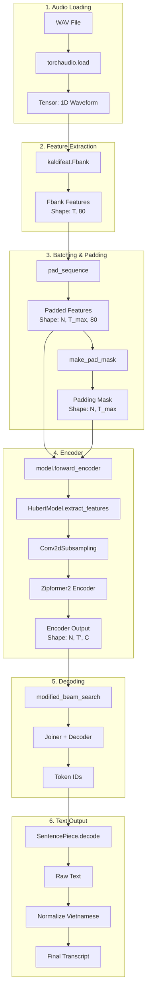

# Luồng Dữ Liệu ASR: Từ Audio Thô đến Text

## Tổng Quan Pipeline



---

## Chi Tiết Từng Bước

### 1. Audio Loading

**File:** `inference.py` line 125-131

```python
# Load audio từ file WAV
wave, sample_rate = torchaudio.load(audio_path)

# Verify sample rate (phải là 16kHz)
assert sample_rate == 16000

# Lấy channel đầu, đảm bảo contiguous memory
wave = wave[0].contiguous()  # Shape: (num_samples,)
```

**Input:** File `.wav`  
**Output:** `torch.Tensor` shape `(num_samples,)`

**Ví dụ:**
- Audio 3 giây @ 16kHz → tensor shape `(48000,)`

---

### 2. Feature Extraction (Fbank)

**File:** `inference.py` line 194-212, `inference_api.py` line 267-279

```python
# Cấu hình Fbank
opts = kaldifeat.FbankOptions()
opts.device = device                    # cuda or cpu
opts.frame_opts.dither = 0              # No dithering
opts.frame_opts.snip_edges = False      # Không cắt edges
opts.frame_opts.samp_freq = 16000       # Sample rate
opts.mel_opts.num_bins = 80             # 80 mel bins

fbank = kaldifeat.Fbank(opts)

# Trích xuất features
features = fbank(waves)  # List[Tensor] → List[(T_i, 80)]
```

**Input:** List of waveforms `[(num_samples_1,), (num_samples_2,), ...]`  
**Output:** List of Fbank features `[(T_1, 80), (T_2, 80), ...]`

**Công thức T:**
```
T = (num_samples - frame_length) / frame_shift + 1
  = (num_samples - 400) / 160 + 1
  ≈ num_samples / 160
```

**Ví dụ:**
- Audio 3s (48000 samples) → ~300 frames → shape `(300, 80)`

---

### 3. Batching & Padding

**File:** `inference.py` line 212-218

```python
# Padding value = log(1e-10) để tránh log(0)
LOG_EPS = math.log(1e-10)

# Pad các features về cùng độ dài
features = pad_sequence(
    features, 
    batch_first=True, 
    padding_value=LOG_EPS
)
# Shape: (N, T_max, 80)

# Tính độ dài thực của mỗi sample
feature_lengths = torch.tensor([f.size(0) for f in features])

# Tạo padding mask
from icefall.utils import make_pad_mask
padding_mask = make_pad_mask(feature_lengths)
# Shape: (N, T_max), True = padded position
```

**Ví dụ:**
- Batch 2 audio: [300 frames, 200 frames]
- After padding: shape `(2, 300, 80)`
- Padding mask: `[[False]*300, [False]*200 + [True]*100]`

---

### 4. Encoder Forward

**File:** `model.py` line 108-138

```python
def forward_encoder(self, x, padding_mask):
    """
    Args:
        x: Fbank features, shape (N, T, 80)
        padding_mask: shape (N, T), True = padded
    
    Returns:
        encoder_out: shape (N, T', C)
        encoder_out_lens: shape (N,)
    """
    encoder_out, padding_mask, encoder_out_lens = \
        self.encoder.extract_features(
            source=x,
            padding_mask=padding_mask,
            mask=False,  # No masking during inference
            do_final_down_sample=True,
        )
    return encoder_out, encoder_out_lens
```

**Bên trong HubertModel.extract_features:**

```python
# 1. Conv2dSubsampling (downscale 4x about)
#    Input: (N, T, 80)
#    Output: (N, T/4, 512)

# 2. Zipformer2 Encoder
#    - 6 stacks với downsampling factors: 1,2,4,8,4,2
#    - Output: (N, T', encoder_dim)
#    - T' ≈ T / (4 * final_downsample)

# 3. Final downsampling (nếu final_downsample=1)
#    - Giảm thêm 2x
```

**Ví dụ:**
- Input: `(2, 300, 80)` 
- After Conv2d: `(2, ~75, 512)`
- After Zipformer: `(2, ~75, 384)`
- With final_downsample=1: `(2, ~37, 384)`

---

### 5. Decoding (Modified Beam Search)

**File:** `beam_search.py` line 1567-1771

```python
def modified_beam_search(
    model,
    encoder_out,        # (N, T', C)
    encoder_out_lens,   # (N,)
    beam=4,             # Beam size
):
    """
    Transducer beam search với max_sym_per_frame=1
    """
    blank_id = model.decoder.blank_id  # = 0
    context_size = model.decoder.context_size  # = 2
    
    # Joiner projection
    encoder_out = model.joiner.encoder_proj(encoder_out)
    
    for t in range(T'):
        # 1. Lấy encoder output tại frame t
        current_encoder = encoder_out[:, t, :]
        
        # 2. Decoder forward với context
        decoder_input = previous_tokens[-context_size:]
        decoder_out = model.decoder(decoder_input)
        
        # 3. Joiner: combine encoder + decoder
        logits = model.joiner(current_encoder, decoder_out)
        
        # 4. Beam search: chọn top-k tokens
        log_probs = logits.log_softmax(dim=-1)
        topk_tokens = log_probs.topk(beam)
        
        # 5. Update hypotheses
        ...
    
    return best_hypothesis.ys  # List[token_ids]
```

**Output:** List of token IDs (không bao gồm blank)

---

### 6. Text Decoding

**File:** `inference.py` line 240-249

```python
# Decode BPE tokens → text
sp = SentencePieceProcessor()
sp.load("bpe.model")

text = sp.decode(token_ids)
# Ví dụ: [234, 567, 89] → "xin chào"

# Normalize Vietnamese
text = normalize_tone_and_typos(text)
# "a lô" → "alo"
# "òa" → "oà"
```

---

## Tham Số Quan Trọng

| Tham Số | Giá Trị | Ảnh Hưởng |
|---------|---------|-----------|
| `sample_rate` | 16000 | Phải đúng 16kHz |
| `feature_dim` | 80 | Số mel bins |
| `frame_length` | 25ms (400 samples) | Độ dài window |
| `frame_shift` | 10ms (160 samples) | Hop length |
| `context_size` | 2 | Decoder context |
| `beam_size` | 10 | Số beam cho search |
| `final_downsample` | 1 | Downsample output encoder |

---

## So Sánh 2 Pipeline

### A. Training/Decode với Lhotse (decode.py)

```
Lhotse CutSet → PrecomputedFeatures → HubertAsrDataset
                                          ↓
                    batch["audio"] = Fbank (đã precompute)
                    batch["padding_mask"] = mask
                                          ↓
                              model.forward_encoder
```

### B. Inference từ Raw Audio (inference.py, inference_api.py)

```
WAV File → torchaudio.load → kaldifeat.Fbank (on-the-fly)
                                   ↓
                        pad_sequence + make_pad_mask
                                   ↓
                        model.forward_encoder
```

**Khác biệt chính:**
- Training: Fbank được precompute và lưu trong manifest
- Inference: Fbank được tính on-the-fly từ raw audio

---

## Đảm Bảo Consistency

Để kết quả inference khớp với decode.py:

1. **Sample rate:** Phải là 16000
2. **Fbank config:** 
   - `num_bins = 80`
   - `dither = 0`
   - `snip_edges = False`
3. **Padding value:** `math.log(1e-10)`
4. **Model params:**
   - `final_downsample = 1`
   - `use_layer_norm = 0`
